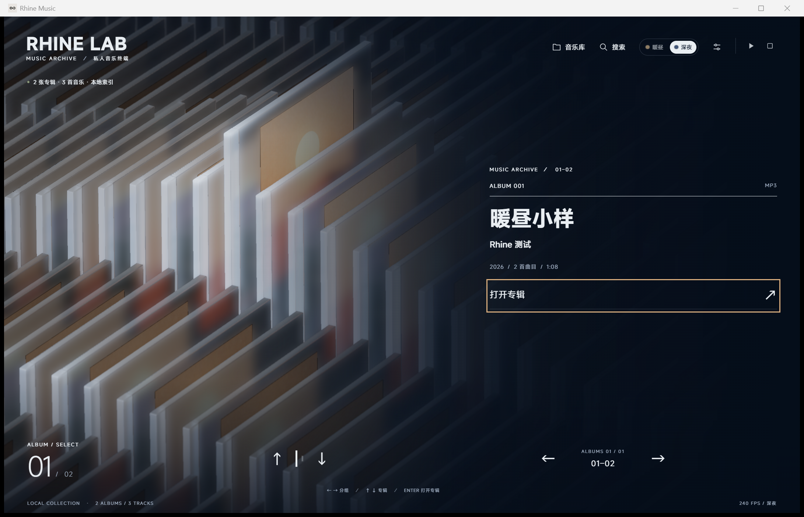

# Rhine Music · v0.3.0 Windows 客户端

**把本地音乐放进三维专辑架。** 以玻璃 CD 盒浏览收藏，打开专辑、查找歌曲，并在独立 Windows 窗口中播放本机音乐。

音乐适配：[RonaldDeng](https://github.com/RonaldDeng) · Windows 客户端改编：ccdr4gon · 基于 [LBEILC / RhineLabUI](https://github.com/LBEILC/RhineLabUI)

[Windows 使用与构建](docs/WINDOWS.md) · [连接本机播放器](docs/PLAYER-SKIN.md) · [更新记录](CHANGELOG.md) · [设计细节](DESIGN.md) · [版权与来源](NOTICE.md) · [原 v0.2.0 macOS 发布](https://github.com/RonaldDeng/Rhine-Music-Demo/releases/tag/v0.2.0)



> v0.3.0 使用 **Tauri + Rust 独立客户端**，Windows 现只提供 **Portable Edition 免安装版**。完整解压 ZIP 后双击 `Rhine Music.exe`，不需要 Node.js、npm 或外部浏览器，不附带歌曲。程序需要系统已有 WebView2，不会自动下载安装组件。设置和缓存位于程序旁的 `data/`；尚未公开发布新标签。具体范围见 [Windows 记录](docs/WINDOWS.md)。macOS 保留原 Node 服务启动方式，原 v0.2.0 发布包不变。上方是前期安装版使用合成 MP3 的历史截图，视觉实现继续沿用。[客户端截图说明](docs/media/v0.3.0/README.md)

## Windows 客户端

Windows 不再生成安装包，不需要安装 Node.js、Rust 或 Blender。界面使用系统已有的 Microsoft Edge WebView2；程序不自动安装任何组件。

1. 完整解压 `Rhine-Music-0.3.0-windows-x64-portable.zip` 到可写目录，进入 `Rhine Music` 文件夹，双击 **Rhine Music.exe**。
2. 点击“**音乐库**”，通过“选择文件夹”添加音乐目录，也可以直接填写 `D:\Music` 这样的绝对路径，每行一个目录。
3. 保存并扫描。歌曲仍从原目录只读播放，不复制进安装目录、不改写标签。

不要直接在压缩包里运行，也不要单独移动 exe：`web/` 是必需资源，`data/` 是首次运行生成的设置、索引和界面缓存。搬移或备份时，先退出程序，再复制整个文件夹；更新程序时保留自己的 `data/`。应用不会自动导入旧安装版的数据。

尚未准备音乐时，可点击“先查看演示封面”体验三维界面。再次打开程序会聚焦现有窗口；关闭窗口退出程序并停止内部服务。`启动音乐播放器.cmd` 也能打开客户端，不安装组件或打开外部浏览器。

也可以点击“连接播放器”，或双击 `启动播放器皮肤.cmd`，把当前界面用作本机播放器的外观与控制窗口。网易云音乐在运行时会自动连接，也可以在“播放器”面板里选择其他来源。它连接 Windows 系统媒体会话，按来源实际能力显示当前曲目、封面及播放控件；未提供标准会话的网易云另有兼容方式。连接网易云后还可以开启“显示网易云播放队列”，阵列按队列顺序一首歌一个盒子，并跟随正在播放的歌；默认同时“按歌单分列”（可在面板里关闭），专辑架上每一列就是你在网易云里创建的一个歌单，列旁写着歌单名称，正在播放的歌单那一列是播放队列，其他各列只供浏览；以调试端口启动网易云后，停在哪个盒子上，网易云就播放哪首歌，详情中还会显示播放进度并可拖动。鼠标滚轮可以平滑地长距离切换。按 `S` 可以把队列展开成“选歌场景”：一串封面加一份文字列表，点哪首选哪首。声音由原播放器输出，不需要导入本地曲库。这里不提供云端歌单、账号或付费歌曲访问，兼容方式及限制见 [播放器连接说明](docs/PLAYER-SKIN.md)。

<details>
<summary>从 Windows 源码构建</summary>

开发电脑需要 Node.js 22.12 或更新的 LTS、Rust 的 MSVC 工具链、Visual Studio C++ 构建工具及 Windows SDK。在工程目录用 PowerShell 执行：

```powershell
npm.cmd ci
npm.cmd run desktop:build
```

Portable ZIP 输出到 `release/`；构建强制使用 `--no-bundle`，不生成 NSIS/MSI。开发运行用 `npm.cmd start`；Rust 测试用 `npm.cmd run check:desktop`。Node 和 Vite 只参与构建，不放入便携包。更详细的依赖与命令见 [Windows 文档](docs/WINDOWS.md)。

</details>

<details>
<summary>macOS 原入口和浏览器调试方式</summary>

macOS 原入口继续使用 Node.js 22.12 或更新的 LTS（包含 npm），以及支持 WebGL 2 的浏览器。完整解压源码后双击 `启动音乐播放器.command`，或执行：

```sh
bash "启动音乐播放器.command"
```

若只是可执行权限丢失，可执行 `chmod +x "启动音乐播放器.command"` 后再双击。提示找不到 Node.js / npm 时，先安装符合版本要求的 Node.js，然后重新打开终端。

旧服务的跨平台入口现为 `npm run start:legacy`；`npm start` 已改为 Tauri 开发运行。Windows PowerShell 若阻止 `npm.ps1`，将命令中的 `npm` 写为 `npm.cmd`，无需修改系统执行策略。

也可以手动安装、构建并保持服务在前台运行（Windows PowerShell 将 `npm` 写为 `npm.cmd`）：

```sh
npm ci
npm run build
npm run music -- --port 5175
```

打开 [http://127.0.0.1:5175/](http://127.0.0.1:5175/)，以终端输出地址为准。前台运行用 `Ctrl+C` 停止。

旧 Node 启动器优先使用 `5175`，占用时顺延到空闲端口。它创建的是后台服务，关闭终端或浏览器不等于停止服务；日志位于工程旁 `music-data-v3/player-service.log`。更新前，在任务管理器或活动监视器中退出对应服务；实际端口的 `/api/health` 提供 `pid`。不要让新旧服务同时操作同一数据目录。

`npm run dev` / `npm run preview` 只提供前端，不能代替本地音乐服务。首次依赖安装与构建完成后，扫描本地文件和播放不要求在线资料查询成功。

</details>

## 可以做什么

| 功能 | 使用方式与效果 |
| --- | --- |
| 浏览收藏 | 按流派、歌手或专辑名排列；滑尺标记与编号同步，分类和专辑首尾循环。三维进场约 5.2 秒，可跳过。 |
| 认出专辑 | 每个盒子顶边左侧的小色块取自它的封面：封面里最突出的颜色，黑白封面为灰色；没有封面图的盒子是琥珀色。 |
| 打开专辑 | 盒体抽出，镜头同步上抬与横移，保留略平于主页的俯视；在卡片上拖动可旋转查看。 |
| 连续换专辑 | 详情右上“上一张／下一张”直接沿队列换片，信息先退出再进入。回到主页继续使用正常浏览速度。 |
| 选歌场景 | 按 `S` 或“选歌”：抬起的盒变成大封面，同一列前后的盒子排成一串封面（选中的盒在大封面正下方：下边是之后的，左边远处是之前的，与专辑架和详情的方向一致），右侧玻璃面板列出歌曲。点击一行播放这首歌；点一张封面把它换成大封面；点大封面或按 `S` 进入详情，Esc 回到专辑架。 |
| 三个场景 | 专辑架、详情、选歌场景各有按钮通往另外两个，按键处处相同：`Enter` 详情，`S` 选歌场景（在选歌场景里则回到详情），`Esc` 专辑架；选歌场景列表里的 `Enter` 仍是选中或播放那一行。点击选中的盒进入详情。 |
| 播放手势 | 播放／暂停时（外部播放器的“停止”也是），选中的盒轻轻一跳，并向四周泛起波纹；三个场景都有，减少动态效果时没有。 |
| 窗口 | 没有系统标题栏：右上角三个按钮最小化、最大化／还原、关闭；拖动窗口顶部的空白处移动窗口，双击最大化。 |
| 搜索歌曲 | 点具体歌曲结果后进入专辑，平滑滚到该曲目并高亮一次，**不会自动播放**。在详情中搜索会先返回专辑架，再移动并重新打开。 |
| 播放音乐 | 点歌单中的歌曲，从该曲开始连续播放当前专辑；顶部提供播放／暂停。切歌淡入淡出默认开启，可在设置中关闭。 |
| 调节体验 | 暖昼／深夜主题；横竖屏自适应；独立的歌曲、氛围配乐及音效音量；画质与减少动态效果。 |
| 管理资料 | 读取标签、封面、格式和时长，增量扫描；可选择查询有来源的百科介绍和 MusicBrainz 资料，不改写音频标签。 |


*演示详情不包含真实歌单；加入本地音乐后显示实际歌曲和标签。*

<details>
<summary>查看暖昼主题</summary>


</details>

### v0.2.0 的主要变化

- 搜索后定位具体曲目并提示；区分搜索导航和详情内直接换片。
- 修正换片结束时封面比例跳变；壳体沿用 v0.1.1b 的轻磨砂透射，封面随场景光照变暗。
- 改进标题拟合与缓存，第二行一起滚入，清理 `g / j` 等下伸笔画的残留。
- 修正深夜横屏返回主页时遮罩与文字的层级跳变，底色、文字和导航分别淡入。
- 歌曲淡入淡出默认开启，先淡出当前曲再淡入下一曲。**已有保存的开关选择继续沿用**。

导航栏、主题滑块、辅助标志、字轮与响应式的设计说明见 [DESIGN.md](DESIGN.md)，配有底部导航、字符滚动、专辑抽取与连续换片的实际 GIF；完整版本演进见 [CHANGELOG.md](CHANGELOG.md)。

## 操作速查

| 操作 | 功能 |
| --- | --- |
| `← / →` | 切换当前排列方式的分类，首尾循环 |
| `↑ / ↓` | 切换当前分类的专辑；详情中直接换片；选歌场景的列表内移动焦点，`Enter` 选中或播放 |
| `Enter` | 打开当前专辑的详情（也可点击选中的盒）；进场期间跳过进场 |
| `S` | 专辑架、详情中进入选歌场景；选歌场景中切到详情 |
| `Space` | 播放／暂停（选中的盒轻轻一跳）；尚未选曲时播放当前专辑 |
| `/` 或“搜索” | 查找专辑与歌曲 |
| `Esc` | 关闭弹窗；详情和选歌场景中都返回专辑架；进场期间跳过进场 |
| 点击歌单中的歌曲 | 从指定曲目开始播放 |
| 拖动详情中的 CD 盒 | 旋转查看封面与盒体 |

输入框内不会触发曲库导航快捷键。设置中的“切歌淡入淡出”采用约 **450ms 淡出 → 换曲 → 450ms 淡入**，两首歌不叠播。氛围配乐在歌曲播放前淡出、整张专辑播完后恢复；暂停歌曲时保持安静（顶部的停止按钮已删除，本地模式没有手动停止）。

## 数据与升级

Windows 客户端默认数据目录为 **`%LOCALAPPDATA%\io.github.ccdr4gon.rhine-music\`**，保存目录配置、索引、封面缓存、流派规则和 `preferences.json` 中的界面偏好。歌曲始终从原路径读取，不复制进安装目录、不修改标签。个人曲库和本机配置**不包含在源码或安装包中**。

原 macOS／浏览器服务继续使用工程旁的 `../music-data-v3/`。客户端不会自动寻找、读取旧曲库。迁移时先退出旧服务，备份原数据；可以在客户端重新选择音乐目录，或用 `MUSIC_DATA_DIR` 指向已有数据。旧浏览器中的主题、画质和音量不会自动转移到客户端，需在客户端重新选择。保留旧目录便于回退，避免两套程序同时写同一数据目录。

需要使用其他数据位置时，在工程目录运行。Windows PowerShell：

```powershell
$env:MUSIC_DATA_DIR = 'D:\RhineMusicData'
.\启动音乐播放器.cmd
```

macOS：

```sh
MUSIC_DATA_DIR="../music-data" bash "启动音乐播放器.command"
```

从 macOS 转到 Windows 时，请重新填写 Windows 音乐目录并扫描；旧索引中的 macOS 路径不能直接使用。更换数据目录前退出已有客户端；已运行时再次启动只会聚焦原窗口。安装版也可在设置好环境变量的终端直接运行安装目录中的 `rhine-music.exe`。

根目录直属音频各为一个单曲专辑；子文件夹按每个含音频的文件夹归并，多个 CD 子文件夹目前分别识别。移动歌曲或文件夹会产生新 ID；暂时离线的根目录保留缓存。旧根目录合辑重扫后变为独立单曲，原合辑的人工流派不会自动分发给新单曲。

## 支持范围与常见问题

**能索引但不能播放？** 标签解析与播放解码是两件事。Rust 读取 FLAC、WAV、M4A、MP3、DSF、DFF 等元数据，客户端播放仍由 WebView2 的音频组件处理；DSF／DFF 暂不能播放。M4A 不一定是无损 ALAC。本版不提供外部播放器、DAC 或 DSD 直出承诺。

**大窗口下帧率较低？** 三维玻璃、阴影、环境遮蔽和景深会增加渲染开销，可在设置中降低画质或关闭景深。截图右下角数值仅是拍摄当时的状态，不是性能基准。静止时右下角约显示 60 FPS：画面不变或只剩缓慢漂移时，客户端降低刷新以节省资源，操作时恢复为屏幕刷新率。

**占用多少内存和显存？** 本机打开专辑时约 0.3 GB 内存（任务管理器“内存”一列，各进程私有工作集合计）和约 0.9 GB 显存（“GPU 专用内存”）。显存主要用于全分辨率的玻璃、多重采样与后处理缓冲，窗口越大越多；“提交大小”约 1.3 GB，其中大部分是为这些显存所做的预留，并非实际占用的内存。最小化后程序停止绘制、继续播放，约 10 秒后显存降到约 0.27 GB，恢复窗口时自动重建。界面运行在系统自带的 Microsoft Edge WebView2（Chromium 内核）中。

**改了源码却没有更新？** 客户端请重新 `npm run desktop:build` 并运行新产物；仅执行 `npm run build` 只重建前端。旧浏览器调试方式需要停止旧服务后重启。

**没有专辑介绍？** 介绍是可选查询结果，不会编造缺失资料。“查询／更新专辑介绍”核对正式百科页面的专辑、歌手和年份，保留出处。MusicBrainz 自动补全默认关闭，启用前填写自己的联系邮箱或项目网址；只发送查询所需文字／公开 ID，不上传歌曲。断网、限流、同名或资料不全时会保留对应状态。

服务仅监听 `127.0.0.1`，用于本机访问。GitHub 上公开的是源码，不是可读取你曲库的在线音乐网站。本版尚无歌词、频谱、均衡器、在线搜歌或云同步；音乐入口没有开放独立 360° 查看器、拆解与重组功能。

## 开发文档与检查范围

- [DESIGN.md](DESIGN.md)：现行视觉与交互设计、细节参数和演进依据。
- [CHANGELOG.md](CHANGELOG.md)：上游、音乐原型、v0.2.0 与 v0.3.0 客户端迁移记录。
- [音乐服务说明](docs/MUSIC-SERVICE.md)：数据目录、索引规则、API、音频与在线资料。
- [v0.2.0 发布检查](docs/RELEASE-V0.2.0.md)：历史浏览器版本的检查项目与未覆盖范围。
- [Windows 客户端检查](docs/WINDOWS.md)：Windows 安装、构建和当前验证范围。
- [历史记录](verification/README.md)：上游、V2/V3 等阶段的设计与验证资料。

Windows 客户端使用 TypeScript、Three.js、Tauri 和 Rust；开发构建使用 Node.js 和 Vite。源码保留两种锁文件、运行资源、模型源文件与生成脚本，排除 `node_modules`、`dist`、Rust 构建目录和个人数据。安装包包含 Rust 程序、`web/` 下的已构建界面资源和许可证，不包含 Node、npm 或开发依赖目录。模型维护见 [art/README.md](art/README.md)。原版档案入口 `?original=1` 与音乐界面共享资源；旧导航可用 `?nav=previous` 对照。

验收以 [Windows 记录](docs/WINDOWS.md) 中实际执行的项目为准。历史浏览器截图不代表客户端已通过全部音频格式、真实设备性能、线上资料覆盖率或全套功能回归验收。

## 版权与来源

**音乐适配与后续修改：Copyright (c) 2026 RonaldDeng。**

**上游 RhineLabUI：Copyright (c) 2026 LBEILC。**

有权授权的代码、建模脚本及技术文档沿用 [MIT License](LICENSE)，两方署名和许可原文均保留；复用或分发代码及其重要部分时应继续保留。上游初始提交为 [`5abab023`](https://github.com/LBEILC/RhineLabUI/tree/5abab02367465d9189f4ae65bcb6f17fdb5938f7)，[原版说明](README.original.md)与 Git 历史一并保留。音乐适配不代表上游作者参与或认可本版本。

《明日方舟》及「莱茵生命：访问」中的名称、标志、设定、视觉和声音归相应权利人所有，本项目与官方无隶属关系。**代码 MIT 不自动覆盖模型、图像、字体或原 PV 采样，也不代替第三方授权。** MiSans、Rolling Number、Three.js、music-metadata、OpenCC-JS 等保留各自许可；原 PV 三个短音不纳入 MIT。完整来源、许可边界及对应文本请见 [NOTICE.md](NOTICE.md)。
