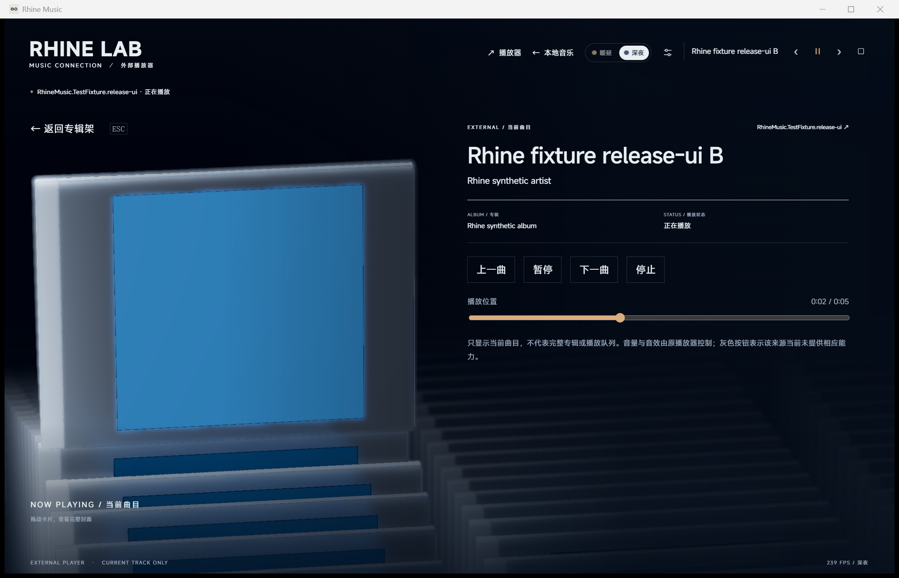

# 连接本机播放器

Rhine Music 的播放器皮肤模式复用现有三维场景，展示另一款播放器的当前曲目，并把可用的播放指令交给它。声音继续由原播放器输出。本地曲库模式保留，两个模式之间通过页面切换释放 Rhine 自身的音频。

## 入口与使用

- 在客户端中点击“连接播放器”。网易云音乐在运行时会自动连接（默认连接，见下）；其他播放器在“播放器”面板里选择。
- 也可以运行便携目录或源码根目录的 `启动播放器皮肤.cmd`。它调用原生程序的 `--skin` 参数，不依赖 Node。
- 命令行可以运行 `rhine-music.exe --skin`；已有 Rhine 窗口时会把该窗口切到皮肤模式。`--local` 切回本地模式。
- 原播放器可能需要先播放一首歌，Windows 才会发布它的媒体信息。Rhine 不代替原播放器登录、搜索云端歌单或获取付费歌曲。

只连接用户明确选择的播放器，网易云音乐是唯一的默认连接（2026-10-04 按用户要求加入）：

- 用户还没有自己选择来源时，发现网易云音乐即自动连接；先打开 Rhine、后打开网易云也一样。列表里网易云一行标有“默认”。
- 网易云曾是已连接的播放器（默认或手动选择）、断开后重新出现时自动接回。这是同一款播放器的新会话，不是换到别的播放器；它在“窗口标题”与系统媒体会话两种来源之间变化时同样接回。
- 用户选择了别的播放器时不替换它；那个播放器消失后停止控制，重新出现也需要重新选择，更不会换成网易云，避免把暂停或切歌发给另一款应用。
- 用户点“断开连接”之后不再自动连接，直到再次手动选择某个来源。
- 自动连接是一次新的连接：不带入“允许发送全局媒体键”的许可；播放队列与切歌仍只按用户已保存的开关读取和发送。

关闭 Rhine 不会关闭原播放器。

Windows 在循环、切曲或其他播放器退出时可能重新创建会话对象。Rhine 优先匹配原对象；对象变化时，仅在前后都只有一个来源属于相同 Windows 应用标识（SourceAppUserModelId）时保持连接。这个标识由系统媒体接口提供，区别于可以重名的显示名称，相关处理在 `src-tauri/src/media/windows_media.rs`。同一应用有多个来源时不猜测对应关系，无法确认则要求重新选择；不同应用标识之间绝不转移控制。

## 能力范围

Windows 的系统媒体会话（Global System Media Transport Controls，GSMTC）让应用发布当前曲目，并接收播放指令；`src-tauri/src/media.rs` 通过这个接口连接兼容的播放器。

| 来源 | 显示 | 控制 | 限制 |
| --- | --- | --- | --- |
| 发布系统媒体会话的播放器 | 对方提供的标题、歌手、专辑、封面、状态和时间信息 | 对方允许的播放/暂停、上一首、下一首、停止和进度跳转 | 每项能力分别检测；应用未提供的内容不补造 |
| 网易云音乐，已在其设置中打开“开启SMTC” | 标题、歌手、162×162 封面和播放状态 | 定向的播放/暂停、上一首、下一首 | 系统媒体会话不提供专辑、时长和进度；调试端口可用时由它提供时长与进度并可拖动，见“选中盒子切歌”一节。该开关默认关闭 |
| 没有系统媒体会话的网易云兼容方式（未打开上述开关） | 网易云进程所属隐藏窗口的歌曲标题和歌手 | 用户在界面明确启用后，使用 Windows 系统媒体键播放/暂停及切歌 | 系统媒体键不是定向接口；存在其他系统媒体会话时拒绝发送。窗口标题不提供封面、专辑、进度和播放状态；调试端口可用时时长与进度由它提供并可拖动，见“选中盒子切歌”一节 |
| 没有系统媒体会话、也没有已实现兼容方式的播放器 | 暂不可连接 | 暂不支持 | 不通过读取进程内存、账号数据库或模拟全局快捷键猜测适配 |

系统接口只提供当前播放内容，不能读取完整云端曲库、收藏和队列。因此界面默认只展示所选来源的当前曲目卡片，不把它伪装为完整专辑；网易云来源可由用户另行开启播放队列和切歌，见后两节。即使提供专辑名或曲目总数，也不能据此生成未知曲目列表。网易云兼容方式的播放状态显示为未知；没有调试端口时不显示进度，调试端口可用时进度来自网易云的读数，两次读数之间由时钟推进。

皮肤模式不会启动 Rhine 的本地歌曲或氛围 BGM，歌曲音量由原播放器管理。本地扫描、百科查询和歌曲淡入淡出设置属于本地模式。玻璃材质、封面受光、字轮、主题和画质设置继续使用现有实现。

## 调研依据与隐私

参考本机 EarthOnline 项目的 `backends/music-control/` 和 `docs/refactor/music-capability-report-2026-09-01.md`。其历史实测网易云 `3.1.39.205426` 不发布系统媒体会话，隐藏窗口不响应定向控制，因此采用标题读取和系统媒体键。本次本机已安装 `3.1.41.205529`，历史结论不能直接当作新版本验收结果。

本次重新执行只读探测：`3.1.41.205529` 可通过窗口标题提供曲名和歌手，未发现它的系统媒体会话。检测时另有一个浏览器的媒体会话，网易云兼容控制按规则禁用；没有对真实网易云或该浏览器发送播放指令。

2026-10-02 补充：同一版本的 `cloudmusic.dll` 已内置系统媒体会话，设置中的“开启SMTC”默认关闭，客户端代码还带有按账号分组的实验开关，因此部分账号可能看不到该选项。打开后，网易云以 `cloudmusic.exe` 发布会话，提供标题、歌手、播放状态和 162×162 JPEG 封面，并接受播放/暂停、上一首、下一首；不提供专辑和时间信息。它把封面类型声明为 `image/jpeg,image/jpe,image/jpg`，Rhine 原先只接受单一类型而丢弃封面，现已按图片实际签名选择列表中的类型。打开开关后兼容方式自动隐藏，控制改为定向发送，不再使用系统媒体键。实际客户端已显示该封面，验证中没有发送播放指令。

网易云还在本地保存播放历史和歌单缓存（`Library/webdb.dat`）。播放历史 Rhine 不读取；其中用户自己创建的歌单，在显示播放队列且“按歌单分列”开着（默认开着）时读取，范围见“按歌单分列”一节。当前播放队列的读取见下一节。通用控制使用自行建立的两个真实 Windows 媒体会话验收，不能据此宣称已逐一验证所有品牌播放器。

Rhine 使用本进程 Rust 调用 Windows 接口，便携包不引入 Node、EarthOnline 后台程序或 PowerShell 服务。不读取网易云进程内存、Cookie、账号数据库和播放历史，不把当前曲目或队列写入磁盘；从网易云公开图片服务器加载的封面图片，按内置浏览器的普通缓存规则留在 `data/webview` 里。经用户允许，开发阶段可以连接网易云的本机调试端口，范围见“选中盒子切歌”一节。系统媒体封面仅作为受限大小的图片在内存中传给界面。

## 网易云播放队列 · 2026-10-03

用户希望阵列显示网易云正在播放的队列，而不是重复同一张当前曲目封面。连接网易云来源后，“选择播放器”面板中出现“显示网易云播放队列”。它默认关闭，开启状态保存在本机偏好中；断开或换成其他来源时不读取。

- **来源**：网易云把当前播放队列写在 `%LOCALAPPDATA%\NetEase\CloudMusic\webdata\file\playingList`。在 3.1.41 的客户端代码中，替换、清空和追加队列都会立即重写这个文件；本机核对时，文件与网易云正在使用的队列完全一致、顺序相同。Rhine 每秒只检查修改时间和大小，变化后才重新读取；读到写入一半的文件时保留已显示的队列，下一次再读。
- **只取显示字段**：歌曲编号、歌名、歌手、专辑名、专辑编号、时长和专辑封面地址。封面地址只接受网易云公开图片服务器 `pN.music.126.net`，统一改用 HTTPS，并按 1024 × 1024 请求；该服务器允许跨域读取。文件中的本地歌曲路径与推荐信息不读取，也不读取 Cookie、账号和播放历史。队列的来源歌单（编号与名称）以及 `webdb.dat` 里的歌单，只在“按歌单分列”开着时读取（打开队列后默认开着），见该节；关闭后，读取队列的程序不去看这些字段。超过 32 MB 的文件跳过，最多显示 3,000 首。
- **阵列**：一首歌一个盒子，顺序就是队列顺序，因此移动一个盒子就是换一首歌，网易云自己切到下一首时阵列也只移动一格；同一专辑的歌显示同一张封面，同一首歌重复入队只列一次。详情显示这首歌的专辑、时长与状态，并保留上一曲、播放 / 暂停、下一曲等控制。（最初按专辑合并成盒，用户要求“切换盒子即切歌”后改为一首一盒。）
- **索引块**（2026-10-04）：每个盒子顶边左侧的小色块取这首歌封面的颜色，没有取到封面的歌仍是琥珀色。颜色只用已经为显示封面而读取的图片像素计算，不另外读取、保存或发送任何数据。
- **跟随**：调试端口可用时，按网易云报告的歌曲编号确定正在播放的歌；否则按系统媒体会话（或窗口标题）报告的歌名匹配，同名时比较歌手。网易云换歌时，阵列沿最短方向移到那首歌，详情打开时直接换片。用户手动浏览后暂停跟随，网易云自行换歌或用户回到正在播放的歌时恢复；用户仍在滚动时不会被拉回。

限制：顺序是网易云列表里的显示顺序，随机播放时实际播放顺序不同；私人 FM 等不写入该文件的模式不显示其队列；文件格式可能随网易云版本变化。

## 按歌单分列 · 2026-10-04

用户要求：皮肤模式的专辑架上，每一列是一个网易云歌单，旁边标出歌单名称。此前显示队列时整个专辑架只有一列。

“显示网易云播放队列”打开后，面板里多出“按歌单分列”。它默认打开（用户于 2026-10-04 要求；最初默认关闭），播放队列的同意说明写明打开队列会同时读取本机歌单；可以单独关闭，状态保存在本机偏好中（换了新的偏好项，旧版本保存的“关闭”不沿用）。播放队列本身仍须用户打开。

- **来源**：网易云把歌单保存在本机数据库 `%LOCALAPPDATA%\NetEase\CloudMusic\Library\webdb.dat`（SQLite，未加密）。Rhine 以只读、不加锁的方式打开它（`mode=ro&immutable=1`），不会挡住网易云自己的写入，也不创建日志文件；不复制、不修改这个数据库；读到的歌单名称和歌曲列表只留在内存里，Rhine 不把它们写入磁盘或日志。（封面图片与播放队列的封面一样，从网易云公开图片服务器加载，会按内置浏览器的普通缓存规则留在 `data/webview` 里。）因为不加锁，读取可能撞上网易云正在写入：读取前后比较文件头、大小和修改时间，并查看回滚日志是否处于写入中，撞上时重读，仍不一致就保留已显示的歌单、稍后再读。每 30 秒（播放队列变化时也会）重新读取歌单列表和各歌单的歌曲编号；与上次相同时不再查找歌曲、也不更新画面。只有当列表里还有歌曲在本机没有记录时，才每次重新查找歌曲，使它们在网易云保存后出现。
- **只取这些**：`persistentModel` 表中 `async:hostResource` 这一行里“我创建的歌单”列表（每个歌单的编号、名称、封面地址、歌曲数、是否“我喜欢的音乐”），以及标明哪个歌单是“我喜欢的音乐”的编号（`starPlaylistId`）；`playlistTrackIds` 表中这些歌单的歌曲编号；`dbTrack` 表中这些歌曲的显示字段（与播放队列相同：编号、歌名、歌手、专辑名与编号、时长、公开封面地址）。另外，从播放队列文件里取队列的来源歌单编号与名称，用来认出哪一列是正在播放的队列。
- **不读取**：收藏的（别人创建的）歌单；歌单的创建者和用户字段；喜欢歌曲的映射；播放历史、播放次数、缓存的接口响应、云盘歌曲等其他表和行；Cookie 与内置浏览器的存储。调试端口没有用于读取歌单。
- **上限**：最多 200 个歌单，每个歌单最多 3,000 首，合计最多 12,000 首；超过大小上限的行跳过。超过上限而没有显示的部分，面板会说明。
- **每一列**：每个在这台电脑上有歌曲数据的歌单是一列，顺序与网易云里一致。网易云只为在这台电脑上打开或播放过的歌单保存歌曲列表；没有保存的歌单不出现，面板会说明有几个这样的歌单，在网易云里打开或播放一次后出现。
- **正在播放的那一列**：播放队列来自其中某个歌单时，那一列显示的是队列本身（顺序、增删都以网易云的队列为准），停在盒子上切歌、跟随网易云换歌等行为与单列时完全相同。队列来自别处（专辑、搜索、别人的歌单）时，队列单独成为最前面的一列。
- **其他各列只供浏览**：停在这些列的盒子上不会让网易云播放，Rhine 没有为它们增加任何调试端口动作；浏览其他列时，网易云换歌也不会把画面拉回。回到队列那一列时，落在正在播放的那首歌上，不触发切歌；网易云换了另一个歌单播放、原来停着的盒子不再属于队列时，画面跟到新队列里正在播放的歌。其余各列各自记住上次停在哪一首。同一首歌在几个歌单里，各列各有一个盒子。
- **选歌场景**：按 `S` 列出的是当前所在的那一列；不是队列的列会标明“只供浏览”。
- **歌单名称**：选中的一列和两侧相邻的列旁标出编号和名称（更远的列不标），正在播放的那一列的编号用强调色。名称写在这一列朝向镜头的边上，只有文字，没有底板、边框或色条（笔画外有一圈很细的反色衬边，便于在明暗不同的盒子上辨认），有透视，会被它前面的盒子挡住，但不参与景深虚化，所以仍然读得清。（曾有“文字标签”样式和样式选项，已按用户要求删除。）位置：选中列的名称在抬起的盒后方；远侧相邻列的名称在更靠后几行处，显示在选中列上方、抬起的盒的左上方；近侧相邻列的名称从选中行前方开始。名称只在专辑架视图出现，打开专辑或进入选歌场景后消失；竖屏下被标题盖住的近侧一列不标名称。过长的名称以省略号截断（底部的列切换处显示完整名称）。
- **封面**：专辑架上的小封面改为向网易云图片服务器请求 256 × 256 的版本（分列后同时出现的封面多得多），请求失败时退回原来的 1024 × 1024 地址；抬起的盒仍用 1024 × 1024。

限制：数据库的结构可能随网易云版本变化，无法识别时面板显示原因并保持单列队列。歌单内容是网易云上次保存到本机的样子，可能落后于云端。名称与歌曲属于用户的隐私：本仓库的检查、夹具、文档和截图只使用虚构的歌单，源码里也不保留读取真实数据库的测试。

## 选歌场景中的队列 · 2026-10-03

显示队列时，按 `S` 或“播放队列”按钮可以把它展开成选歌场景：左侧是当前选中的歌（大封面）和队列里它前后的歌排成的一串封面（选中的歌在中间：下边是之后的歌，左边远处是之前的歌，与专辑架上的方向一致），右侧玻璃面板以文字列出整个队列，标出正在播放和当前选中的行。点击一行或一张封面，就选中那首歌的盒子；点大封面打开这首歌的详情（不会让网易云播放或暂停）。换歌时面板保持不动，只换标题和画面。网易云自己换歌时，这个场景一样跟随。`S` 或“这首歌”切到详情，`Esc` 或“返回专辑架”回到专辑架。

这个场景不读取也不发送任何新的内容：列表用的是已经读到的队列显示字段，点击走的是原有的“选中盒子”路径，是否让网易云播放仍取决于下面的切歌开关和调试端口。面板下方的说明会随开关和端口的状态更新。只连接了当前曲目、没有打开队列时，不提供这个场景。

## 选中盒子切歌（调试端口） · 2026-10-03

用户要求：在 Rhine 中切换盒子时，网易云也切到这首歌；并说明 Rhine 处于开发阶段，可以访问网易云的调试端口。

**为什么需要调试端口。** 对网易云 3.1.41 的客户端代码做了静态核对，外部没有“跳到队列中某一首”的入口：

| 途径 | 结果 |
| --- | --- |
| 系统媒体会话、全局热键、任务栏按钮 | 只有上一首 / 下一首，远距离要逐首经过中间的歌 |
| `orpheus://` 播放链接（网页“在客户端播放”所用） | 能按歌曲编号播放，但会把这首歌从原位置删除、重新插到当前歌曲之后，并重排随机顺序、重写队列文件；每条链接还会让网易云显示主窗口。不采用 |
| 调试端口（Chrome DevTools 协议） | 可以派发队列面板双击某一行时的同一个动作 `playing/playOneTrackInPlayingList`，不改变队列 |

本机实测（网易云 3.1.41，顺序播放）：跳到队列中相隔几首的另一首，约 40 ms 后网易云报告新歌曲，队列顺序与队列文件都没有变化，前台窗口没有改变。

**做法。** 面板中“显示网易云播放队列”下方有“选中盒子时让网易云切歌”。它默认打开（这是用户要求的行为），可以关闭；只有显示队列、开关打开并且连接的是网易云时，Rhine 才访问调试端口。面板显示端口状态：检测中、已连接、未检测到，或端口返回的错误。打开且调试端口可用时：

- 用户停在一个盒子上约 0.5 秒后（滚轮滑行或连续按键结束之后），Rhine 请求网易云播放这首歌；滚动途中经过的歌不会触发。暂停中的网易云会开始播放，与在网易云队列里双击一致。
- 只在用户自己移动盒子时发送；跟随网易云换歌引起的移动不会回发。请求发出后用户又移到别的盒子，以后一个为准。
- 网易云拒绝或没有切换时提示一次，不循环重试。私人 FM 模式下不切歌。网易云会自动跳过无版权等不能播放的歌曲，此时阵列跟随它实际播放的歌。
- 每秒通过同一端口读取一次当前歌曲编号、播放状态、播放模式、时长和播放位置，用于跟随、确认和进度显示。

**播放进度。** 网易云的播放位置不在它的状态仓库里，而在进度条组件中（它自己的“快进 / 快退 n 秒”命令读的也是这个值），以整秒更新；网易云窗口隐藏或最小化时仍然更新（实测）。详情中的进度条因此显示网易云的真实位置和时长：Rhine 每秒读一次，两次读数之间用自己的时钟推进，读数与时钟不一致（在网易云里拖动、换歌、暂停）时以网易云为准，所以正常播放时秒数均匀前进、不回跳。拖动 Rhine 的进度条并松手时，派发网易云进度条松手时的同一个动作 `playing/setPlayingPosition`，只对网易云当前播放的这首歌生效（读数之后网易云已换歌则放弃），不改变播放或暂停状态；试听歌曲只在试听片段内跳转，已停止或播完的歌曲不能拖动。进度条始终属于“网易云当前曲目”，即使打开的是队列中另一首歌的盒子。按住方向键连续调整时，界面随每一步变化，松开后只向网易云发送一次；多次跳转按先后顺序发送。网易云以非 1 倍速播放或缓冲时，时钟最多走到上一次读数的下一秒就等待，不会先跑过头再跳回。进度显示与拖动同样受“选中盒子时让网易云切歌”开关控制，调试端口不可用时进度条显示“时长不可用”并禁用。实测：读取一次约 2–3 ms；跳到 0:40 用时 24 ms，网易云继续播放。

**范围与风险。** `src-tauri/src/media/netease_debug.rs` 只连接 `127.0.0.1:9233`，每次调用有总时限（读取状态 1.5 秒、切歌与跳转 5 秒），对方再慢也不会拖住界面的轮询；只接受地址以 `orpheus://orpheus/pub/app.html` 开头的页面，并用页面编号自行拼出套接字地址，不使用返回数据里的地址；歌曲编号只允许字母、数字、`_`、`-`，以 JSON 字符串形式写入脚本。在网易云页面内运行的脚本只读取上述播放字段、进度条显示的秒数、试听片段范围、进行中的跳转目标、歌曲是否已加载（播放会话编号、首次加载标记、启动续播记录是否存在）和队列条目的歌曲编号，只派发切歌与跳转这两个动作；不读取 Cookie、存储和账号状态，不在页面上保存任何内容。

调试端口必须在启动网易云时用 `--remote-debugging-port=9233` 打开。网易云内置的浏览器内核是 Chrome 91，不校验连接来源：端口开启期间，本机其他程序（理论上还包括恶意网页）同样可以控制网易云及其登录状态。这是开发阶段接受的取舍，正常启动网易云即关闭端口。

一次检测确认端口没有打开后，面板显示“未检测到网易云调试端口”，并提供“以调试端口重新启动网易云”。按钮需要再点一次确认，然后先请求网易云正常退出，3 秒内未退出则强制结束，再带调试参数启动并等待端口响应（最长约 25 秒）；只处理当前 Windows 会话中的网易云进程，不影响其他已登录用户。重启后系统媒体会话是新的：网易云是默认连接时会自动接回，否则需要在面板中重新选择；网易云可能要先播放一次才会重新发布会话。

没有读取网易云进程内存。

官方接口说明：[会话与控制方法](https://learn.microsoft.com/en-us/uwp/api/windows.media.control.globalsystemmediatransportcontrolssession?view=winrt-26100)、[当前曲目属性](https://learn.microsoft.com/en-us/uwp/api/windows.media.control.globalsystemmediatransportcontrolssessionmediaproperties?view=winrt-26100)。接口存在不表示所有播放器、所有版本均支持；最终以运行时检测和实际验收为准。

具体测试与未覆盖范围见 [Windows 验证记录](WINDOWS.md)。

